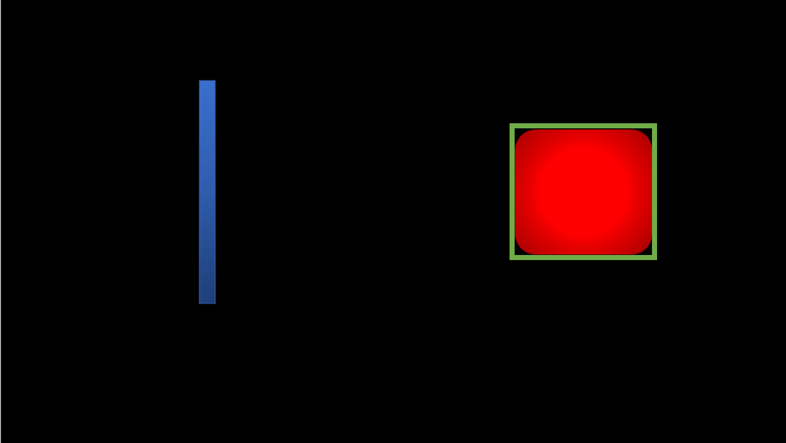
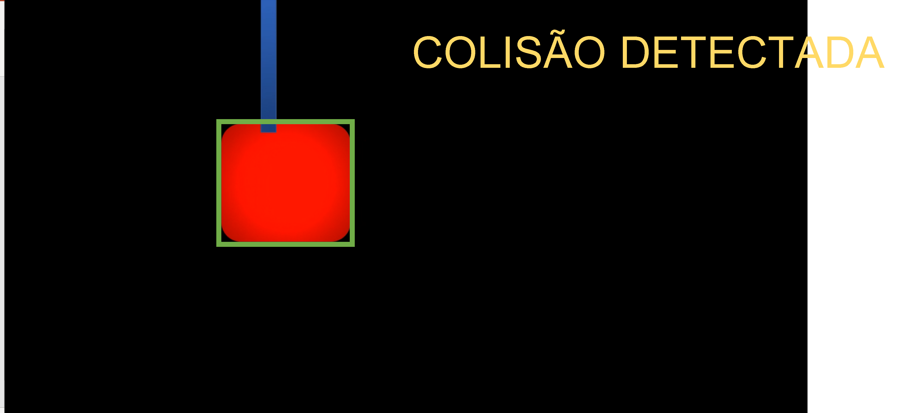

# AI ENGINEERING, COGNITIVE AND SEMANTIC COMPUTATION & IOT

## Processamento Digital de Imagens

**Atividade prática individual.**

Inspirado no contexto do Metaverso para crianças, vamos utilizar Processamento Digital de Imagens para criar um jogo simples.

Você deve fazer um programa que detecta a colisão entre as formas geométricas. 

### Orientações

Você vai trabalhar no arquivo `q1/q1.py`. com o vídeo `q1A.mp4` ou `q1B.mp4`que já estão no diretório.

Utilize o video com base na soma de todos os dígitos do RM:

|Soma RM | Video|
|--------|------| 
|De 1 até 5 | q1A|
|De 6 até 9 | q1B|

Exemplo: RM090174 = 0+9+0+1+7+4  = 21 => 2+1 = 3 usar o víideo q1A

### O que você deve fazer:

Fazer o programa que devolve um output visual de acordo com a rubrica. 

### Rubrica

O que é esperado para cada rubrica:

|Resultado| Conceito| 
|----------|--------|
|R0 – Não executa | 0 |
|R1 – Detecta todas as formas geométrica por cor e produz saída visual demonstrando | 1 |
|R2 – Identifica a forma geométrica de maior massa com um retângulo verde em output visual | 2 |
|R3 – Detecta colisão entre as formas geométricas e identifica escrevendo no output visual “COLISÃO DETECTADA” | 4 |
|R4 – Identifica e exibe que a forma geométrica de maior massa ultrapassou completamente a outra forma geométrica | 5 |

Casos intermediários ou omissos da rubrica serão decididos pelo professor.

#### Dica: 

É esperado como output visual para a R1/R2, resultado do cálculo de massa com o retângulo em verde.

É esperado como output visual para a R3, resultado da detecção de colisão.

É esperado como output visual para a R4, resultado indicando que ultrapassou a barreira .

Se você precisar gerar mais de uma imagem de `debug` para demonstrar como seu programa funciona, as exiba usando a função `cv2.imshow`.

